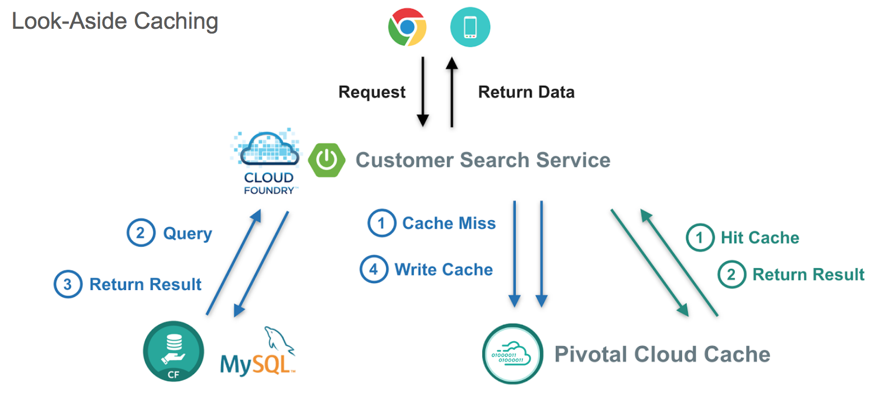

## PivotalCloudCache-Workshop

This workshop will provide developers with hands on experience in building Pivotal Cloud Cache(PCC) clients using Spring Data GemFire (SDG), Spring Data REST, Spring Cloud and Spring Boot. In this session we'll be implementing a pizza store app for ordering pizza backed by PCC. Session includes presentations, demos and hands on labs.



Demo App: 

http://pizza-store-pcc-client.xyz.numerounocloud.com/pizzas

```
Lets Order Some Pizza 
-------------------------------
types: plain, fancy

GET /orderPizza?email={emailId}&type={pizzaType} - Order a pizza 
GET /orders?email={emailId} - get specific value 

```

http://pizza-store-pcc-client.xyz.numerounocloud.com/orderPizza?email=lucynorton@gmail.com&type=fancy

###### Result

Cache Miss Scenario

```
Result [Pizza{name='fancy', toppings=[arugula, chicken], sauce='pesto', Customer='Customer [id=05eKpgOFA, name=Lucy Norton, email=lucynorton@gmail.com, address=48665 Washington, birthday=1965-02-10T06:20:27.828Z]'}] 
Cache Miss for Customer [true] 
Read from [MYSQL] 
Elapsed Time [234 ms]
```

Data Returned From Cache 
```
Result [Pizza{name='fancy', toppings=[arugula, chicken], sauce='pesto', Customer='Customer [id=05eKpgOFA, name=Lucy Norton, email=lucynorton@gmail.com, address=48665 Washington, birthday=1965-02-10T06:20:27.828Z]'}] 
Cache Miss for Customer [false] 
Read from [PCC] 
Elapsed Time [2 ms]
```
